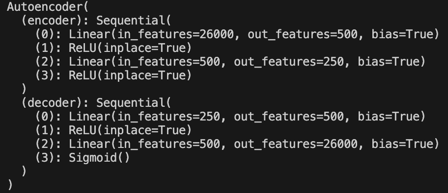

# AnomalyDetection
Anomaly Detection on sensor data with Autoencoders

## Dataset
Data was obtained from the [pump_sensor_data](https://www.kaggle.com/datasets/nphantawee/pump-sensor-data/data) dataset on kaggle. This dataset contains time series data of 52 sensors with 1 min intervals from a water pump systems, as well as normal, broken, and recovering labels.

## Data Processing
To preprocess the data, I broke it up into non overlapping intervals of 500 minutes each. And then split the dataset up into train and validation sets. The train set contained 80% of the purley normal intervals, while the validation contained the other 20% along with all sets containing broken or recovering labels. 

## Modeling
The initial model trained for this task is a simple autoencoder, taking in a flattened 500 (time step) by 52 (sensors) input, encoding to 250 parameters, and then decoding back to the original size. The model was trained on only the test set, using the Adam optimizer to minimize the mean square error loss function between the original and reconstructed input.

## Results

